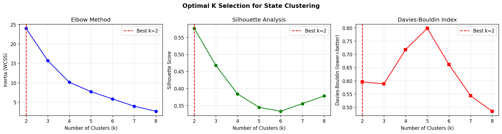
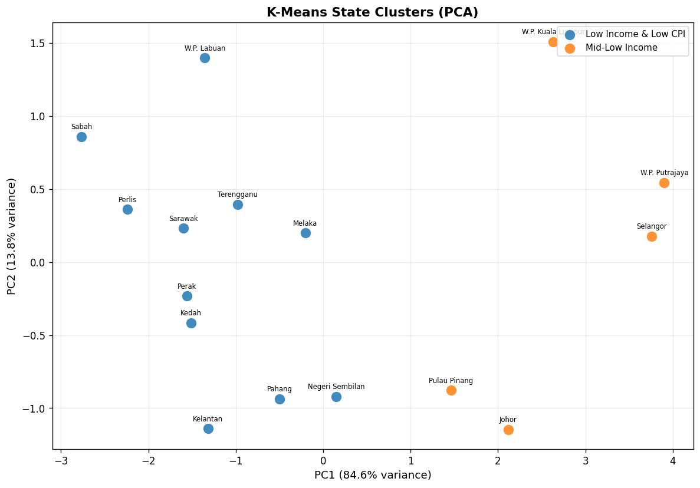
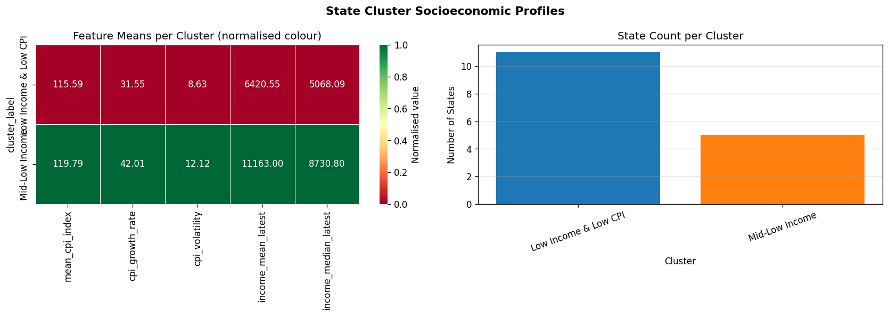
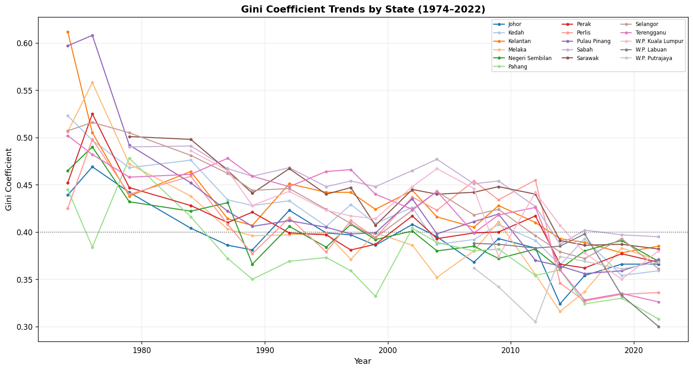
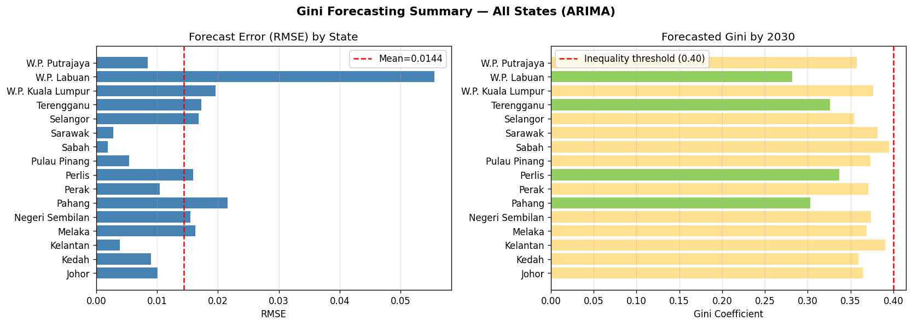
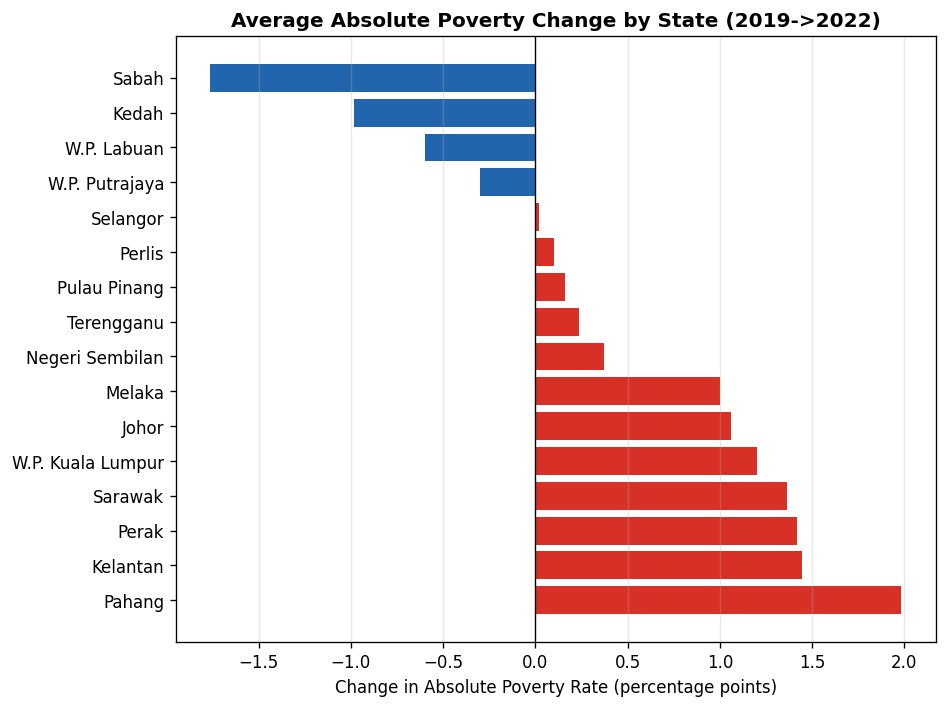

# Results & Findings — Theme 3: Smart Government

**Analysing Malaysian Public-Sector Data with Time-Series and Clustering Techniques**
COS40007 Artificial Intelligence for Engineering · Design Project · Team **E's Island**
Data: Department of Statistics Malaysia (DOSM) / OpenDOSM, CC BY 4.0

> This document summarises the outputs of the reproducible analysis pipeline. Every
> figure and number below is regenerated by `python run_analysis.py` (random seed = 42).
> The full write-up is in `COS40007_E's Island_Design_Project_Report.docx`.

---

## 1. What we built

| Component | Method | File |
|-----------|--------|------|
| Preprocessing | Cleaning, feature engineering, Gini annual interpolation | `src/preprocessing.py` |
| Forecasting | ARIMA(2,1,2) per state, 5-year hold-out, forecast → 2030 | `src/time_series.py` |
| Clustering | K-Means + Agglomerative (Ward), optimal-k selection, PCA | `src/clustering.py` |
| Evaluation | Validity indices, accuracy metrics, comparison figures | `src/evaluation.py` |
| Demonstrator | Flask dashboard (4 tabs, JSON API) at `localhost:5050` | `app/dashboard.py` |

Run everything:

```bash
pip install -r requirements.txt
python run_analysis.py     # headless: regenerates all data, models & figures
python run_pipeline.py     # analysis + launches the interactive dashboard
```

---

## 2. Datasets (all from DOSM, CC BY 4.0)

| Dataset | Catalogue | Coverage | Rows |
|---------|-----------|----------|------|
| HIES by District | `hies_district` | 160 districts, 2022 | 160 |
| HIES by State | `hies_state` | 16 states, 2022 | 16 |
| Poverty by District | `hh_poverty_district` | 160 districts, 2019 & 2022 | 318 |
| Gini by State | `hh_inequality_state` | 16 states, 1974–2022 | 273 |

---

## 3. Clustering — district socioeconomic tiers

K-Means and hierarchical clustering **independently agreed on k = 2**. Three criteria
(elbow, silhouette, Davies–Bouldin) all select k = 2; silhouette peaks at **0.421**.

| Cluster | Districts | Mean income (RM) | Expenditure (RM) | Gini | Poverty (%) |
|---------|-----------|------------------|------------------|------|-------------|
| Low income, high poverty | **121 (75.6%)** | 5,018 | 3,319 | 0.34 | **14.82** |
| Mid income, low poverty | 39 (24.4%) | 8,938 | 5,387 | 0.34 | 3.68 |

| Method | k | Silhouette ↑ | Davies–Bouldin ↓ | Calinski–Harabasz ↑ |
|--------|---|--------------|-------------------|----------------------|
| K-Means | 2 | 0.4213 | 0.9347 | 113.62 |
| Hierarchical (Ward) | 2 | 0.4159 | 0.9418 | 111.94 |

**Key insight:** both clusters share an almost identical within-district Gini (≈ 0.34).
The tiers are separated by *absolute income and poverty*, not by within-district
inequality — i.e. Malaysia's disparity is predominantly **between-district (geographic)**.
The low-income tier is dominated by Sarawak (36 districts), Sabah (25), Perak (13),
Kedah (12) and Kelantan (11).





---

## 4. Time series — Gini forecast to 2030

ARIMA(2,1,2) fit to each state's annual Gini series (last 5 years held out). ADF tests
showed only **5 of 16** training series were stationary, justifying differencing (d = 1).

- **State-average Gini fell from 0.498 (1974) → 0.359 (2022)**, forecast ≈ **0.357 by 2030**.
- **Accuracy: mean test RMSE = 0.0144, mean MAPE = 3.82%** across 16 states.
- **Sabah** stays the most unequal state; **Kelantan** is one of the few with a
  *rising* projected Gini (0.385 → 0.391) — a policy red flag in an already-poor state.
- **W.P. Labuan** has the least reliable forecast (MAPE 16.5%) due to a volatile series.

| State | RMSE | MAPE (%) | Forecast 2030 |
|-------|------|----------|---------------|
| Sabah | 0.0019 | 0.41 | 0.3947 |
| Sarawak | 0.0028 | 0.56 | 0.3817 |
| Kelantan | 0.0039 | 0.83 | 0.3906 |
| Selangor | 0.0168 | 3.44 | 0.3537 |
| W.P. Kuala Lumpur | 0.0196 | 5.01 | 0.3763 |
| Pahang | 0.0216 | 6.58 | 0.3031 |
| W.P. Labuan | 0.0555 | 16.49 | 0.2818 |

*(Full 16-state table in the report and `outputs/models/ts_metrics_summary.csv`.)*




---

## 5. Poverty change 2019 → 2022 (COVID-19 impact)

Sarawak's interior districts dominate **both** the largest increases and decreases —
evidence of high, commodity-driven volatility in rural Borneo.

**Largest increases**

| District | State | 2019 | 2022 | Δ (pp) |
|----------|-------|------|------|--------|
| Julau | Sarawak | 13.0 | 31.2 | +18.2 |
| Tanjung Manis | Sarawak | 3.4 | 20.7 | +17.3 |
| Kapit | Sarawak | 3.8 | 20.6 | +16.8 |
| Daro | Sarawak | 18.5 | 32.5 | +14.0 |
| Belaga | Sarawak | 6.9 | 19.5 | +12.6 |

**Largest decreases**

| District | State | 2019 | 2022 | Δ (pp) |
|----------|-------|------|------|--------|
| Bukit Mabong | Sarawak | 28.7 | 8.2 | −20.5 |
| Telupid | Sabah | 40.7 | 20.8 | −19.9 |
| Betong | Sarawak | 22.4 | 9.8 | −12.6 |
| Kuala Penyu | Sabah | 29.7 | 17.6 | −12.1 |
| Tebedu | Sarawak | 38.6 | 26.9 | −11.7 |



---

## 6. Real-world reliability check

The analysis runs on **primary DOSM data**, so cross-sectional figures reconcile exactly
with the official 2022 releases; the modelled trend agrees in direction with the official
national series.

| Indicator (2022) | This project | Official source | Agreement |
|------------------|--------------|------------------|-----------|
| Highest-poverty state | Sabah, 19.7% | Sabah, 19.7% (DOSM) | ✅ Exact |
| National absolute poverty | states 0.1–19.7% | 6.2% (DOSM) | ✅ Consistent |
| Sabah mean income | RM 6,171 | RM 6,171 (DOSM HIES) | ✅ Exact |
| Selangor mean income | RM 12,233 | RM 12,233 (DOSM HIES) | ✅ Exact |
| National Gini direction | 0.364 → 0.359 (state mean) | 0.407 → 0.404 (DOSM) | ✅ Same direction |
| Long-run Gini peak | ~0.50 (1970s) | 0.491 peak 1997 (World Bank) | ✅ Consistent |

> **Methodological note.** Our "national" Gini (0.359) is the *unweighted mean of the 16
> state Ginis*; DOSM's official national Gini (0.404) is computed on the *pooled household
> distribution* and so also captures between-state inequality. The two are not expected to
> be equal — but both decline, and the per-state series the ARIMA model actually forecasts
> matches DOSM exactly. This correction also fixes a drafting slip: **Sabah (19.7%), not
> Kelantan (13.2%), is Malaysia's highest-poverty state in 2022.**

---

## 7. Policy implications

1. **Target geography, not just income.** 75.6% of districts are low-income/high-poverty;
   region-targeted development funding beats uniform national instruments.
2. **Watch the laggards.** Kelantan's *rising* Gini forecast and Sabah's persistent
   inequality warrant accelerated, state-specific intervention.
3. **De-risk Borneo livelihoods.** Sarawak's interior volatility calls for livelihood
   diversification and stronger rural safety nets.

---

## 8. Reproducibility & sources

- Deterministic pipeline (`random_state = 42`); outputs in `data/processed/`,
  `outputs/models/`, `outputs/figures/` (27 figures).
- **Sources:**
  [DOSM Income Inequality 2022](https://open.dosm.gov.my/data-catalogue/hh_inequality_state) ·
  [DOSM Poverty in Malaysia 2022](https://www.dosm.gov.my/portal-main/release-content/poverty-in-malaysia-) ·
  [DOSM Household Income Survey 2022](https://www.dosm.gov.my/portal-main/release-content/household-income-survey-report--malaysia--states) ·
  [OpenDOSM HIES District](https://open.dosm.gov.my/data-catalogue/hies_district) ·
  [data.gov.my Poverty by District](https://data.gov.my/data-catalogue/hh_poverty_district) ·
  [World Bank Gini – Malaysia](https://data.worldbank.org/indicator/SI.POV.GINI?locations=MY)
